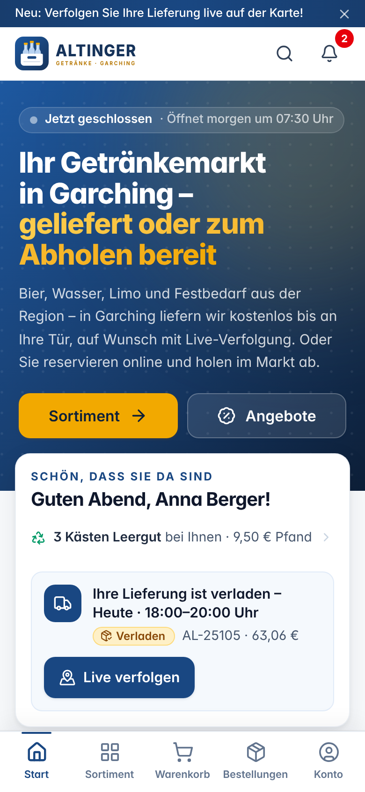
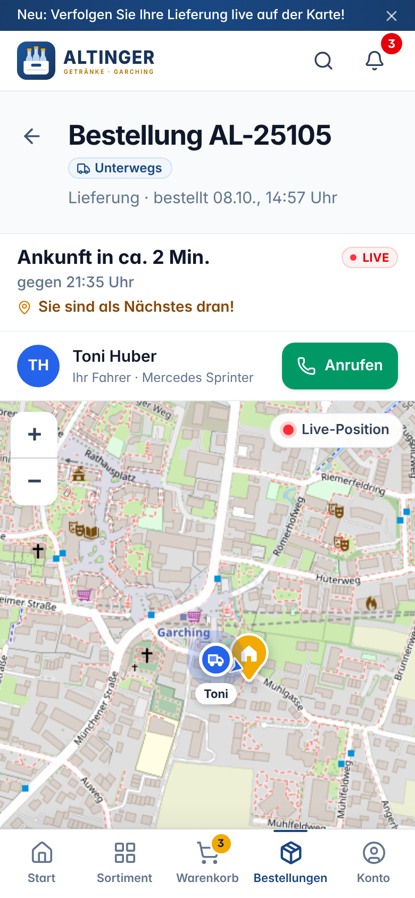
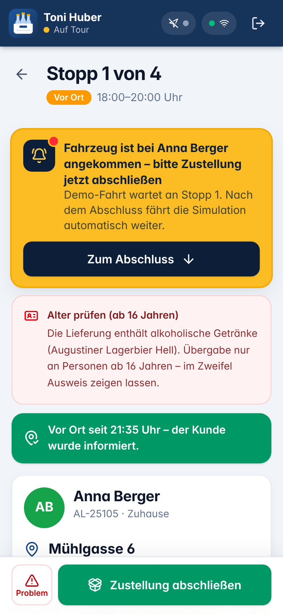
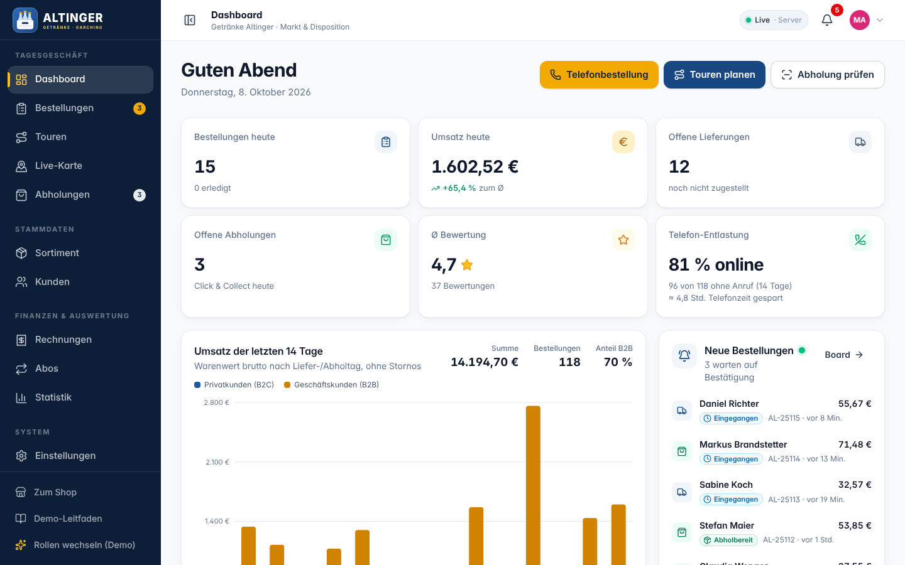
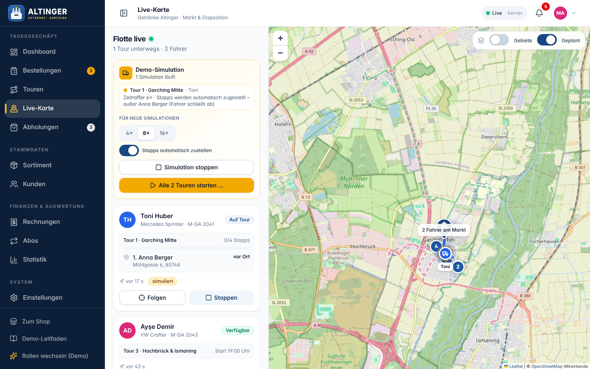
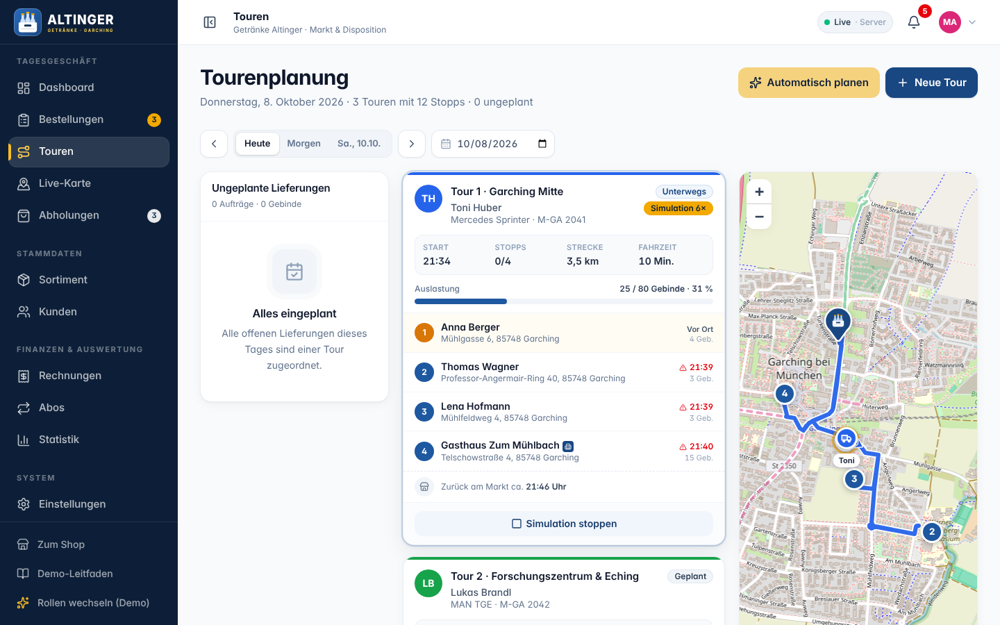
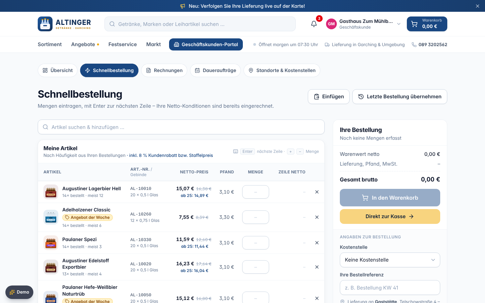

# Getränke Altinger – Bestell-, Liefer- und Markt-App

Installierbare Web-App (PWA) für **Getränke-Altinger GmbH, Freisinger Landstraße 19, 85748 Garching b. München**.
Privat- und Geschäftskunden bestellen Getränke zur Lieferung oder reservieren sie zur Abholung im Markt
(Click & Collect), verfolgen ihre Lieferung live auf der Karte – dazu eine Fahrer-App fürs iPhone und ein
Markt-Dashboard für Disposition, Sortiment und Auswertungen.

Eine Oberfläche für alle Geräte: iPhone, Android, Tablet und Desktop – ohne App-Store.

**Version 1.0.0** – Demo-Stand für die Vorführung beim Inhaber (Server, Oberfläche und Fachkern; `package.json`,
`GET /api/health` und Leitfaden `/demo` zeigen die Version).

> **Demo-Stand.** Alle Personen, Firmen, Bestellungen und Preise der Demo sind fiktiv bzw. Beispielwerte.
> Vor einem Livebetrieb müssen Preise, Sortiment, Öffnungszeiten und Liefergebiete mit dem Markt abgestimmt werden
> (siehe [docs/KONZEPT.md](docs/KONZEPT.md), Abschnitt „Offene Fragen“).

---

## Inhalt

1. [Screenshots](#screenshots)
2. [Funktionen je Rolle](#funktionen-je-rolle)
3. [Schnellstart](#schnellstart)
4. [Demo-Zugänge](#demo-zugänge)
5. [Betriebsmodi: Server und Lokal](#betriebsmodi-server-und-lokal)
6. [Konfiguration](#konfiguration)
7. [Auf dem iPhone installieren](#auf-dem-iphone-installieren)
8. [Projektstruktur](#projektstruktur)
9. [Tests](#tests)
10. [Deployment (Kurzfassung)](#deployment-kurzfassung)
11. [Weitere Unterlagen](#weitere-unterlagen)
12. [Hinweise](#hinweise)

## Screenshots

Alle Bilder liegen in [`docs/screenshots/`](docs/screenshots/) (iPhone 390 × 844 und Desktop 1440 × 900, Demo-Daten).

| Kundin (iPhone) | Live-Tracking (iPhone) | Fahrer-Stopp (iPhone) |
|---|---|---|
|  |  |  |

| Markt-Dashboard | Live-Karte |
|---|---|
|  |  |
| **Tourenplanung** | **B2B-Schnellbestellung** |
|  |  |

---

## Funktionen je Rolle

### Gäste und Privatkunden (Shop, `/`)

- **Sortiment** mit Kategorien, Suche und Filtern; Produktbilder als Illustration, Preise **brutto inkl. MwSt.**,
  Pfand separat („zzgl. 3,10 € Pfand“) und Grundpreis je Liter (Preisangabenverordnung)
- **Angebote der Woche** und Gutscheine (z. B. `WILLKOMMEN10`, `GARCHING`)
- **Warenkorb mit Leergut-Rückgabe** – leere Kästen **und lose Pfandflaschen** (z. B. „Bierflasche lose“) werden bei der
  Lieferung mitgenommen und gutgeschrieben
- **Kasse:** Lieferung oder Abholung, Zeitfenster mit Bestellschluss (nach Ladenschluss schlägt die Kasse automatisch den
  nächsten freien Termin vor), Liefergebiet-Prüfung per PLZ, **Tragservice** bis in die Wohnung, Zahlarten (bar, EC-Karte,
  PayPal/Kreditkarte als Demo), MwSt.-Ausweis „auch auf Pfand“
- **Live-Tracking:** Fahrzeug auf der Karte, voraussichtliche Ankunft, Anzahl Stopps davor, Benachrichtigungen
  („Ihr Fahrer ist da“), Zustellnachweis
- **Click & Collect:** Abholcode und QR-Code, Reservierung wird im Markt bereitgestellt, Leergut an der Theke
- **Kundenkonto:** Bestellungen, Adressen, Favoriten, **Abos** (z. B. alle 2 Wochen ein Kasten Wasser),
  **Leergut-Konto**, Treuepunkte, Benachrichtigungen, Bewertung nach der Lieferung
- **Festservice:** Leihartikel (Garnituren, Kühlschrank, Zapfanlage …) mit Verfügbarkeit und **Party-Planer**,
  der Getränkemengen nach Gästezahl und Dauer vorschlägt
- **Markt-Info:** Öffnungszeiten, Anfahrt mit Karte, Services

### Geschäftskunden (B2B-Portal, `/business`)

- **Nettopreise** zzgl. MwSt., Gruppenrabatt bzw. **Staffelpreise** – der günstigste Preis gewinnt automatisch
- **Schnellbestellung** als Mengenmatrix, Nachbestellen aus der Historie
- **Kauf auf Rechnung** (sofern freigeschaltet), Zahlungsziel, **Rechnungen** mit Druckansicht/PDF
- **Daueraufträge**, mehrere **Lieferstandorte** und **Kostenstellen**, Bestellreferenz
- **Rechnungen mit MwSt.-Aufschlüsselung inkl. Pfand:** Ware, Pfand und Leergut-Rücknahme netto, MwSt. je Satz auf die
  Netto-Summe – ohne Rundungsausgleich
- Online-Antrag „Geschäftskunde werden“ – Freischaltung durch den Markt

### Fahrerinnen und Fahrer (Fahrer-App, `/fahrer`)

- Tagesübersicht mit Touren, **Ladeliste** und Stopps in optimierter Reihenfolge
- **Tour starten** – Kunden werden automatisch benachrichtigt; GPS-Position geht live an Markt und Kunden
  (nur während der aktiven Tour)
- Pro Stopp: Navigation (Apple Karten/Google Maps), „Angekommen“, **Leergut erfassen** (Kästen und lose Flaschen),
  **Altersprüfung** bei Alkohol (ab 16 bzw. 18 Jahren, Pflicht vor dem Abschluss), **Kassieren** bar mit Rückgeld oder
  EC-Karte (Betrag inkl. tatsächlich zurückgenommenem Leergut), **Unterschrift**, **Foto** als Zustellnachweis,
  „Problem“ melden (z. B. nicht angetroffen) mit Grund
- **Fahrtsimulation** für Vorführungen ohne echte Fahrt – auf Wunsch stellt sie automatisch zu und wartet nur an
  ausgewählten Stopps (z. B. Annas), bis der Fahrer selbst abschließt

### Markt und Disposition (Markt-Dashboard, `/admin`)

- **Dashboard** mit Tageskennzahlen und der Kennzahl **„Telefon-Entlastung“** (Anteil der Bestellungen ohne Anruf,
  geschätzte gesparte Telefonzeit); neue Bestellungen erscheinen **live** ohne Neuladen (mit Signalton)
- **Bestellungen** als Board/Liste: bestätigen, kommissionieren, verladen/bereitstellen, stornieren; Kommissionierschein
- **Telefonbestellung:** Kunde suchen, Artikel per Schnellerfassung oder „Zuletzt bestellt“, Zeitfenster, Leergut –
  sofort bestätigt, im Board als „Tel.“ gekennzeichnet (auch per `/admin/bestellungen?neu=telefon`)
- **Tourenplanung:** Bestellungen Fahrern zuordnen, **automatisch planen mit Vorschau** (erst „Übernehmen“ speichert),
  **Optimieren** (ändert nur bei echter Verbesserung), Demo-Simulation je Tour
- **Live-Karte** aller Fahrzeuge, **Abholungen** per Code oder **QR-Kamera-Scan** prüfen, Leergut an der Theke annehmen
- **Sortiment & Bestand**, **Kunden & B2B-Konditionen**, Leergut-Korrekturen
- **Rechnungen**, **Abos & Daueraufträge**, **Statistik**
- **Einstellungen:** Öffnungszeiten, Zeitfenster, Liefergebiete, Gebühren, Gutscheine, Ansage-Banner, Fahrer & Fahrzeuge,
  Demo (Betriebsmodus, „Neue Bestellungen automatisch bestätigen“ – Standard aus –, Demo-Reset)

### Für alle Rollen

- **Echtzeit** über alle Geräte; bei Verbindungsabbruch Banner „Keine Verbindung zum Server – wird automatisch erneut
  versucht“, danach automatisches Nachladen. Ist der Server beim Start nicht erreichbar (z. B. Render-Kaltstart),
  wartet die App mit „Verbinde mit Server …“ – sie wechselt nie still auf lokale Daten.
- **Sitzung je Browser-Tab:** Jeder Tab behält seine Anmeldung (Anna, Toni und Markt nebeneinander möglich).
- Einheitliche Fenstertitel („Live-Karte · Markt · Getränke Altinger“), installierbar als App (PWA), mobil mit fester
  Aktionsleiste über der Tab-Leiste.

### Demo-Leitfaden (`/demo`)

Rollen-Karten mit „Jetzt öffnen“ und QR-Code fürs iPhone, abhakbares Drehbuch (12 Schritte mit Klickpfad, Kernbotschaft,
Zeitbedarf und Direkt-Links), Schnellaktionen – **Tour 1 simulieren** (Standard 8×, Stopps automatisch, Annas Stopp stellt
der Fahrer selbst zu; Einstellungen werden gemerkt, der Stand der Simulation wird live angezeigt), **Neue Bestellungen
automatisch bestätigen** (nur als Marktleitung), Demo-Daten zurücksetzen, Betriebsmodus – sowie Hinweise zu Rollen in
mehreren Tabs, zum Leitfaden auf dem iPhone, zu Installation und GPS.

---

## Schnellstart

Voraussetzung: **Node.js 20 oder neuer** (empfohlen 22) und npm.

```bash
npm install
npm run dev
```

`npm run dev` startet zwei Prozesse:

| Dienst | Adresse | Zweck |
|---|---|---|
| API-Server (Express + socket.io) | http://localhost:8787 | Daten, Echtzeit, Simulation |
| Vite-Entwicklungsserver | **http://localhost:5173** | Oberfläche (leitet `/api` und `/socket.io` an den Server weiter) |

Öffnen Sie **http://localhost:5173/demo** – dort finden Sie alle Zugänge und das Drehbuch.

Der Server zeigt beim Start auch die **WLAN-Adresse** an (z. B. `http://192.168.1.20:5173`), unter der
iPhone und Tablet im selben Netz die App erreichen.

Produktionsbetrieb lokal (ein Prozess, liefert den Build aus `dist/` aus):

```bash
npm run build
npm start          # http://localhost:8787
```

Weitere Skripte:

| Befehl | Wirkung |
|---|---|
| `npm run dev:server` / `npm run dev:web` | nur Server bzw. nur Vite starten |
| `npm run preview` | Build + Produktionsserver |
| `npm run typecheck` | TypeScript-Prüfung (Frontend, Core, Server, Tests) |
| `npm test` | Unit- und Integrationstests (Vitest) |
| `npm run test:e2e` | Browser-Tests (Playwright) |
| `npm run reset-data` | Datendatei `data/db.json` löschen → beim nächsten Start frische Demo-Daten |

---

## Demo-Zugänge

Passwort für alle Konten: **`demo`**. Bequemer geht es über die Demo-Schnellzugänge auf `/login`,
den **Demo-Umschalter** oder den Leitfaden `/demo`. Den Umschalter erreichen Sie am Desktop über die Pille unten links,
das Kontomenü („Demo-Leitfaden & Rollen wechseln“) oder `Alt + D` bzw. `⌥ D`; auf dem Handy ist die Pille
ausgeblendet – dort **dreimal aufs Logo tippen** oder im Seitenfuß „Demo-Leitfaden“ bzw. „Rollen wechseln“.

| Rolle | Name | E-Mail | Startseite |
|---|---|---|---|
| Privatkundin | Anna Berger | anna.berger@example.com | `/` |
| Geschäftskunde (Gastronomie) | Gasthaus Zum Mühlbach | einkauf@gasthaus-muehlbach.de | `/business` |
| Geschäftskunde (Büro) | NordByte Software GmbH | office@nordbyte.example | `/business` |
| Fahrer · Tour 1 | Toni Huber | toni@altinger.example | `/fahrer` |
| Fahrer · Tour 2 | Lukas Brandl | lukas@altinger.example | `/fahrer` |
| Fahrerin · Tour 3 | Ayşe Demir | ayse@altinger.example | `/fahrer` |
| Markt & Disposition | Marktleitung | markt@altinger.example | `/admin` |

**Direkt-Anmeldung per Link/QR-Code:** `https://<adresse>/demo?als=<user-id>` meldet das Gerät automatisch an
und öffnet die Startseite der Rolle – z. B. `/demo?als=u-anna`, `/demo?als=u-toni`, `/demo?als=u-admin`.
`/demo?als=gast` meldet ab (Shop-Ansicht für Neukunden). Die QR-Codes dafür zeigt der Leitfaden `/demo`.

Die Demo-Daten werden jeden Tag frisch erzeugt (heutige Touren, offene Bestellungen, Historie) und lassen sich
jederzeit zurücksetzen: Leitfaden → „Demo-Daten zurücksetzen“, Markt → Einstellungen oder Demo-Umschalter.

---

## Betriebsmodi: Server und Lokal

Dieselbe Oberfläche und derselbe Fachkern laufen in zwei Modi:

| | **Server-Modus** (`remote`, Standard) | **Lokaler Modus** (`local`) |
|---|---|---|
| Daten | Node-Server, Datei `data/db.json` | im Browser (`localStorage`) |
| Echtzeit | socket.io – **alle Geräte** sehen Änderungen sofort | zwischen **Tabs desselben Browsers** |
| Einsatz | Vorführung mit iPhone, Fahrer-Handy und Laptop; Pilotbetrieb | Offline-Demo auf einem Gerät, reines Static-Hosting |

Moduswahl beim Start der Oberfläche:

- `VITE_API_MODE=remote` (beim **Build** gesetzt; so bauen **Render-Blueprint und Dockerfile**): fester Server-Modus.
  Ist der Server kurz nicht erreichbar, zeigt die App „Verbinde mit Server …“ bzw. das Banner „Keine Verbindung“ –
  es gibt **keinen stillen lokalen Modus**.
- `VITE_API_MODE=local`: fester lokaler Modus (reines Static-Hosting, Offline-Demo).
- `VITE_API_MODE=auto` (Standard, z. B. bei `npm run dev`): prüft `GET /api/health` (max. 2,5 s) – Server erreichbar →
  Server-Modus; eindeutig kein Server (404/HTML) → lokal; nur vorübergehend nicht erreichbar → Server-Modus mit Warten.
  Zusätzlich URL-Parameter **`?api=local`**, **`?api=remote`** oder **`?api=auto`** (gilt für den Browser-Tab),
  z. B. `http://localhost:8787/demo?api=local` als Plan B ohne Internet.

---

## Konfiguration

### Server (`server/index.ts`)

| Variable | Standard | Bedeutung |
|---|---|---|
| `PORT` | `8787` | HTTP(S)-Port |
| `HOST` | `0.0.0.0` | Bind-Adresse (0.0.0.0 = im WLAN erreichbar) |
| `DATA_FILE` | `data/db.json` | JSON-Datei mit allen Daten (wird automatisch angelegt, atomar gespeichert) |
| `DEMO_MODE` | `true` | Demo-Anmeldung per Klick und Demo-Reset für alle; `false` = nur Login mit Passwort, Reset nur für den Markt |
| `RESEED_STALE` | `true` | Demo-Daten eines früheren Kalendertags beim Start bzw. um Mitternacht neu erzeugen |
| `HTTPS_CERT` / `HTTPS_KEY` | – | Pfade zu PEM-Zertifikat und Schlüssel → Server spricht HTTPS (z. B. mit mkcert, nötig für GPS auf dem iPhone im WLAN) |
| `CORS_ORIGIN` | alle | erlaubte Herkünfte, kommagetrennt (wenn das Frontend auf einer anderen Domain liegt) |
| `NODE_ENV` | – | `production` → liefert den Build aus `dist/` aus (setzt `npm start` automatisch) |
| `LOG_RPC` | `false` | jede API-Anfrage mit Dauer protokollieren |

### Oberfläche (Vite, beim Build bzw. `npm run dev`)

| Variable | Standard | Bedeutung |
|---|---|---|
| `VITE_API_MODE` | `auto` | `remote` (Deployment mit Server: Render, Docker – nie still lokal), `local` (Static-Hosting) oder `auto` (Entwicklung, `?api=` möglich); siehe oben |
| `VITE_API_URL` | leer (gleiche Herkunft) | Basis-URL des Servers, wenn Oberfläche und Server getrennt gehostet werden, z. B. `https://api.example.de` |
| `API_PORT` | `8787` | nur Entwicklung: Ziel-Port des Vite-Proxys für `/api` und `/socket.io` |

Beispiel: Server auf Port 9000 entwickeln → `PORT=9000 npm run dev:server` und `API_PORT=9000 npm run dev:web`.

---

## Auf dem iPhone installieren

1. App in **Safari** öffnen (z. B. die Render-Adresse oder `http://<WLAN-IP>:5173`).
2. Unten auf **Teilen** tippen.
3. **„Zum Home-Bildschirm“** → „Hinzufügen“.

Die App startet danach im Vollbild wie eine native App. Auf Android/Chrome und am Desktop (Chrome/Edge)
erscheint ein Installationshinweis bzw. ein Installieren-Symbol in der Adressleiste; im Leitfaden `/demo` gibt es
einen „Jetzt installieren“-Knopf.

**GPS und Kamera:** Safari gibt Ortung (Fahrer-App) und Kamera (QR-Scan bei Abholungen) nur über **HTTPS** frei
(Ausnahme: `localhost`). Für Vorführungen genügen die eingebaute **Fahrtsimulation** bzw. die Code-Eingabe; für echtes GPS
die App über HTTPS bereitstellen – automatisch bei Render, im WLAN mit mkcert (siehe [docs/DEPLOYMENT.md](docs/DEPLOYMENT.md)).

---

## Projektstruktur

```
shared/                 läuft unverändert im Browser und in Node
  types.ts, api.ts      Vertrag: Domänenmodell und API-Schnittstelle
  time.ts, format.ts    Zeitzone Europe/Berlin, Euro/Datum/Status-Texte
  core/                 Fachkern: Preise, Zeitfenster, Touren, Routing, Simulation, Berechtigungen
    handlers/           alle API-Methoden (auth, catalog, customer, orders, driver, admin …)
    seed/               Demo-Daten (Sortiment, Kunden, Fahrer, Touren, Historie)
server/                 Express + socket.io, Persistenz (JSON-Datei), Auslieferung von dist/
src/
  api/                  Datenanbindung (Server oder lokal), React-Query-Hooks, Echtzeit-Brücke
  components/           UI-Kit, Layouts, Karten (Leaflet), Produkt-Illustrationen, PWA
  features/             Seiten je Bereich: shop, checkout, orders, account, events, b2b, driver, admin, demo
  stores/               Client-Zustand (Anmeldung, Warenkorb, Positionen, UI)
  lib/                  kleine Browser-Helfer
e2e/                    Playwright-Tests
docs/                   Architektur, Konzept, Demo-Drehbuch, Deployment
Dockerfile, render.yaml Deployment
```

Technik: React 18, TypeScript (strict), Vite 7, Tailwind CSS 4, React Router 6, TanStack Query 5, Zustand,
Leaflet/OpenStreetMap, Recharts, socket.io, Express 4, vite-plugin-pwa (Workbox). Details:
[docs/ARCHITECTURE.md](docs/ARCHITECTURE.md).

---

## Tests

```bash
npm test                 # Vitest: Fachkern (Preise, Zeitfenster, Touren, Berechtigungen …) und Server
npm run test:e2e         # Playwright: baut die App und startet den Produktionsserver auf Port 8790
```

Die E2E-Tests laufen in zwei Projekten – **Desktop Chromium** (1440 × 900) und **iPhone** (Chromium, 390 × 844,
Touch) – mit einer temporären Datendatei; `data/db.json` bleibt unberührt.

| Variable | Wirkung |
|---|---|
| `E2E_BASE_URL=http://localhost:5173` | gegen einen laufenden Server testen (z. B. `npm run dev`), ohne Build |
| `E2E_SKIP_BUILD=1` | vorhandenen Build aus `dist/` verwenden |
| `E2E_PORT=8790` | Port des Test-Servers |

Beim ersten Mal ggf. den Browser installieren: `npx playwright install chromium`.

---

## Deployment (Kurzfassung)

| Ziel | Vorgehen | Ergebnis |
|---|---|---|
| **Render** (empfohlen für die Vorführung) | Repository verbinden → Blueprint `render.yaml` (baut mit `VITE_API_MODE=remote`, Health-Check `/api/health`) | HTTPS-Adresse, Echtzeit, GPS und Kamera auf dem iPhone |
| Railway / Fly.io | Dockerfile verwenden (ebenfalls `VITE_API_MODE=remote`, `HEALTHCHECK`) | wie Render |
| Eigener Server | `docker build -t altinger .` → `docker run -p 8787:8787 -v altinger-data:/app/data altinger` | volle Kontrolle, Hosting in der EU |
| Netlify / Vercel | Build mit `VITE_API_MODE=local`, Ordner `dist` | nur lokaler Modus, keine geräteübergreifende Echtzeit |
| Lokales WLAN | `npm run build` + `HTTPS_CERT`/`HTTPS_KEY` (mkcert) + `npm start` | HTTPS im Messe-/Besprechungs-WLAN |

Schritt-für-Schritt-Anleitungen inkl. **„In 10 Minuten online für die Demo“**: [docs/DEPLOYMENT.md](docs/DEPLOYMENT.md).
Auf dem Free-Tarif schläft Render nach ca. 15 Minuten ein (Kaltstart bis ca. 1 Minute) – für die Vorführwoche Tarif Starter.

---

## Weitere Unterlagen

- [docs/KONZEPT.md](docs/KONZEPT.md) – Konzeptpapier für das Gespräch mit Getränke-Altinger
- [docs/DEMO-DREHBUCH.md](docs/DEMO-DREHBUCH.md) – Ablauf der Vorführung mit Gerätezuordnung, exakten Beschriftungen, Zeitbedarf, Kernbotschaften und Plan B
- [docs/DEPLOYMENT.md](docs/DEPLOYMENT.md) – Bereitstellung (Render, Docker, Static-Hosting, HTTPS im WLAN)
- [docs/ARCHITECTURE.md](docs/ARCHITECTURE.md) – Architektur und Regeln für die Entwicklung
- [docs/FRONTEND-API.md](docs/FRONTEND-API.md) – Bausteine der Oberfläche

---

## Hinweise

- **Demo-Daten sind fiktiv.** Kundennamen, Firmen, Adressen und Bestellungen sind erfunden. Markenartikel
  (Augustiner, Paulaner …) stehen beispielhaft für das übliche Sortiment eines bayerischen Getränkemarkts.
- **Preise, Pfandbeträge und Öffnungszeiten prüfen.** Die Demo verwendet Beispielpreise und die Öffnungszeiten
  Mo–Fr 7:30–20:00, Sa 7:30–16:00. Öffentliche Verzeichnisse nennen teils abweichende Zeiten – vor dem Livegang
  mit dem Markt abstimmen.
- **Rechtstexte** (Impressum, Datenschutz, AGB) sind Platzhalter und müssen vor einem Livebetrieb erstellt werden.
- **Zahlungen** (PayPal, Kreditkarte) sind in der Demo simuliert; für den Livebetrieb ist ein Zahlungsanbieter anzubinden.
- Kartendaten © OpenStreetMap-Mitwirkende; Routing über den öffentlichen OSRM-Demodienst mit Luftlinien-Rückfall –
  für den Livebetrieb einen eigenen bzw. kommerziellen Routing-Dienst verwenden.
